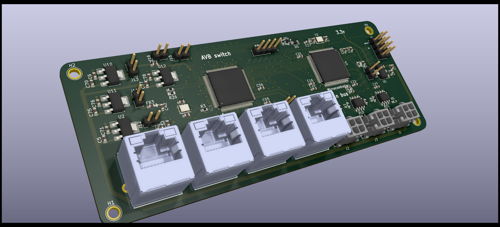
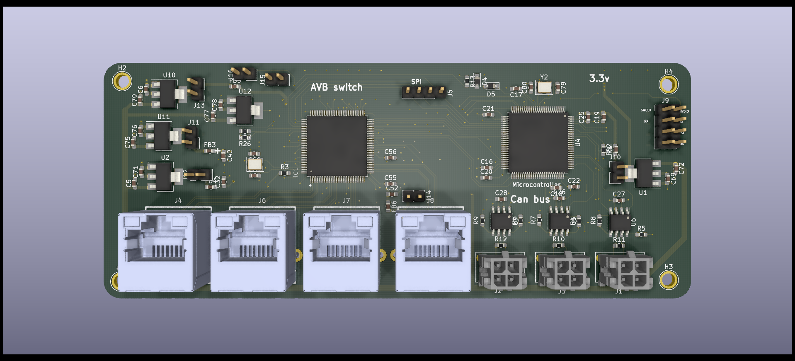
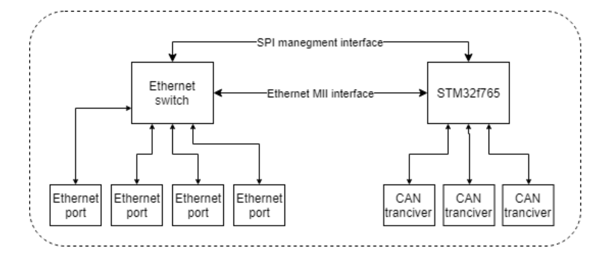

# AVB_Ethernet_switch_with_CAN_bus

This PCB was made As part of an Academic engineering final project, the idea behind it is to offer a method of reorganizing information traffic in autonomous vehicles,

The problem I wanted to solve is how to expand the current communication method to support Advanced Drive assist application.

The proposed solution is to build a network built from a combination of CAN bus and Ethernet interfaces, were Ethernet used as backbone.

To do so I design and implement module that aim to manage data traffic and with him create a hierarchical Democratic multi master network were every node can exchange data.

To meet the requirements of critical information passing through a vehicle, the Ethernet switch ic supports the AVB protocol to Ensure real time policy.

The component was assimilated in Ben-Gurion University FSAE electric car in 2019

## PCB 3D Model

